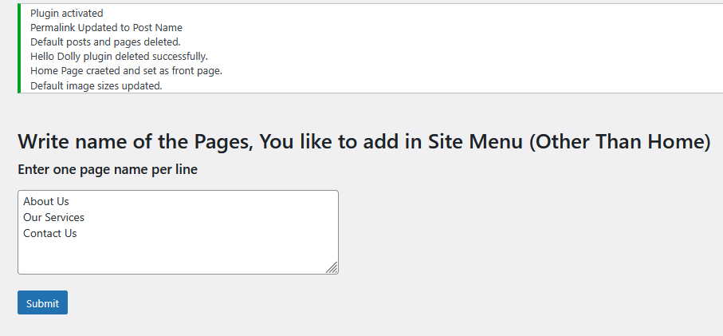

# 🔌 NK Initial Settings – WordPress Plugin

A lightweight and essential plugin to preconfigure your WordPress site with initial settings like permalinks, default cleanup, homepage creation, and menu setup — all in one click. 

Developed by **Nidhi Kaura** under the brand [WebSolutions4You](https://websolutions4you.in).

---

## 📌 Features

    ✅ Sets pretty permalinks (/%postname%/)

    🗑️ Deletes default posts, pages, and Hello Dolly plugin

    🏠 Creates a Home page and sets it as the front page

    🖼️ Configures custom image sizes (thumbnail, medium, large)

    📄 Creates commonly used starter pages like About, Contact, Privacy Policy, etc.

    📋 Automatically creates and assigns a navigation menu

    ⚙️ Ideal for developers, freelancers, and agencies building new WordPress sites
    
---

## 📸 Screenshots

Below is the screenshot showcasing what will happen after activation of plugin.

Upon clicking the submit button, the pages will be created automatically, and a menu will be generated that includes these pages along with the home page.

---

### 🔧 Admin Settings Panel

---

## ⚙️ Installation

📥 How to Install

 1. Download the folder from this repository.
 2. Compress the plugin folder into a .zip file.
 3. In your WordPress dashboard, navigate to Plugins → Add New → Upload Plugin.
 4. Click Choose File, select the .zip file, and click Install Now.
 5. Once installed, click Activate Plugin to start using it.

---

## 📄 License

Plugins is licensed under the [GPL v2 or later](./LICENSE).

---

© 2025 Nidhi Kaura – WebSolutions4You

